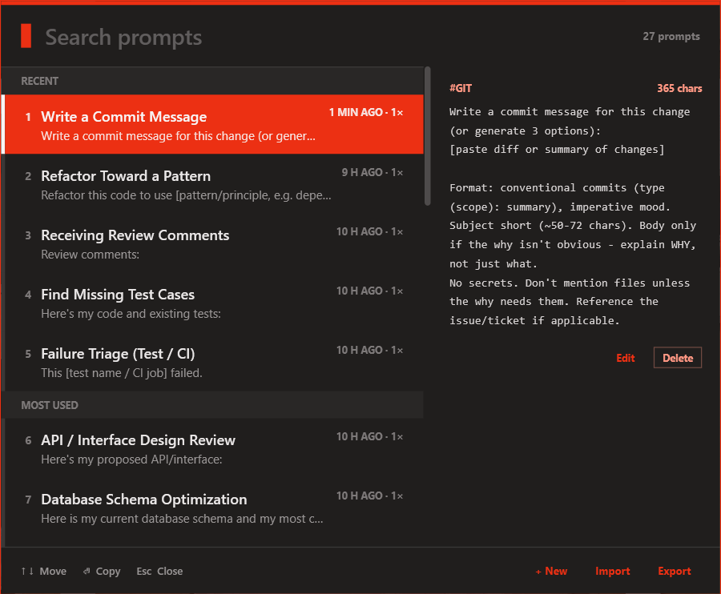
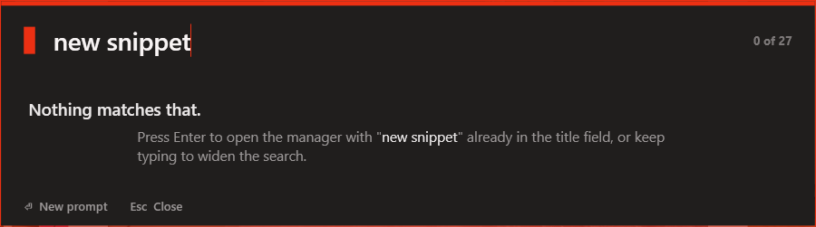
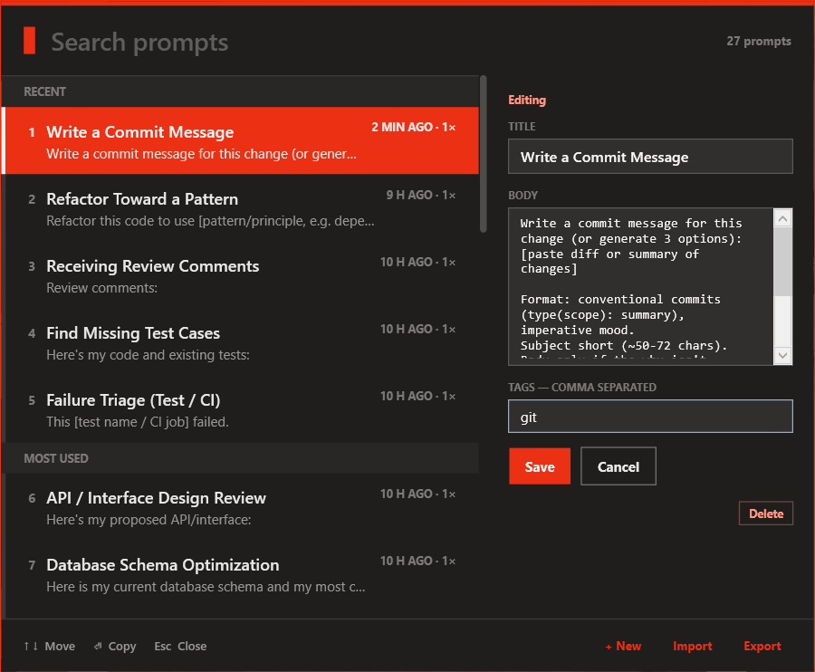
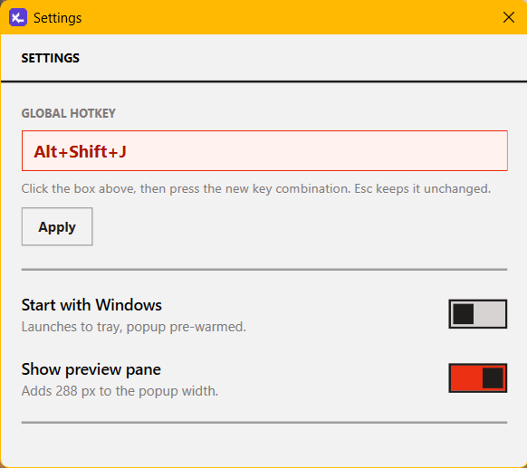

# Prompt Manager

Windows tray utility for storing reusable text prompts/snippets. A global hotkey opens a
Spotlight-style search popup over whatever app has focus — search, preview, and
<kbd>Enter</kbd> to copy-and-paste the selected prompt into the window you were just in.
Everything else (create, edit, delete, import, export) lives inline in that same popup —
there's no separate manager window. Runs at startup, lives in the tray.

Default hotkey: **Alt+Shift+J** (rebindable from Settings).



## Features

- **Global hotkey** opens a borderless popup on top of whatever you're doing; <kbd>Esc</kbd>
  dismisses it with no side effects.
- **Fuzzy search** (VS Code Quick Open-style) ranks title matches above body/tag matches; an
  empty query shows Recent and Most Used groups instead.
- **Copy-and-paste in one step** — <kbd>Enter</kbd> (or click) copies the selected prompt to the
  clipboard and pastes it into the previously focused window.
- **Inline editing** — the preview pane is read-only until you hit Edit, which turns it into a
  form (title, body, tags) with Save/Cancel; Delete asks for confirmation first.
- **New / Import / Export** (JSON) grouped in the popup's footer, next to the keyboard hints.
- **Settings** — rebind the hotkey by clicking the box and pressing a new combination, toggle
  "Start with Windows", toggle the preview pane.

## Screenshots

| | |
|---|---|
|  | Search popup — fuzzy-matched results on the left, read-only preview (tags, Edit, Delete) on the right. |
|  | No matches — <kbd>Enter</kbd> starts a new prompt titled with whatever you typed. |
|  | Edit mode — the same pane becomes a form; Save, Cancel, or Delete. |
|  | Settings — rebind the hotkey, toggle startup and the preview pane. |

## Requirements

- Windows 10/11
- [.NET 10 SDK](https://dotnet.microsoft.com/download)

## Build & run

```powershell
dotnet build CodeSnippet\CodeSnippet.slnx
dotnet run --project CodeSnippet\CodeSnippet\CodeSnippet.csproj
```

The app has no visible main window on launch — it registers the global hotkey and puts an icon in
the system tray. Right-click the tray icon for **Search prompts**, **Settings...**, and **Exit**.

## Usage

- Press the global hotkey to open the popup. Type to filter, <kbd>&uarr;</kbd>/<kbd>&darr;</kbd>
  to move the selection, <kbd>Enter</kbd> to copy and paste into the previously focused window,
  <kbd>Esc</kbd> to close.
- Select a prompt and click **Edit** to change its title/body/tags, or **Delete** to remove it
  (confirmation required).
- **+ New** starts a blank prompt in the same edit form; typing an unmatched query and pressing
  <kbd>Enter</kbd> does the same with that text prefilled as the title.
- **Import**/**Export** round-trip the whole library as JSON.
- **Settings...** (tray menu) rebinds the hotkey and toggles "start with Windows" / the preview
  pane.

## Data

Prompts are stored as JSON at `%AppData%\CodeSnippet\prompts.json`; app settings (hotkey binding)
at `%AppData%\CodeSnippet\settings.json`. Both load fully into memory at startup; writes happen
on a background task so no UI action blocks on disk I/O.

## Notes

- `SendInput`-based paste can be blocked by Windows UIPI when the target window is running
  elevated (as administrator) while Prompt Manager is not. In that case the prompt still lands on
  the clipboard even though the automatic paste doesn't fire — paste manually with Ctrl+V.
- Built with WPF + `CommunityToolkit.Mvvm` (source-generated bindings/commands, no reflection) and
  `H.NotifyIcon.Wpf` for the tray icon.
